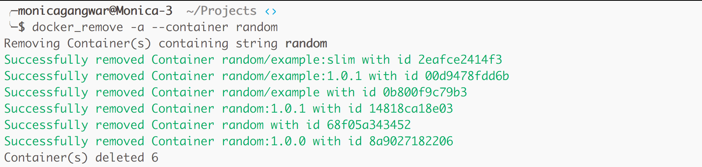
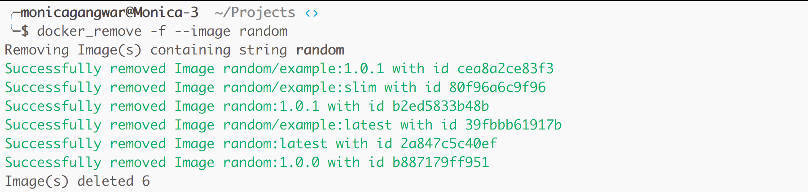
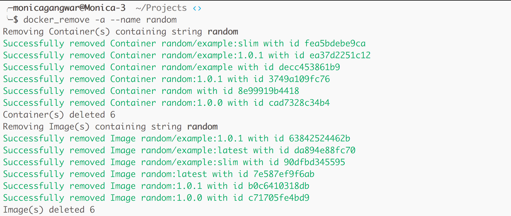

.. image:: https://badge.fury.io/py/docker_remove.svg
    :target: https://badge.fury.io/py/docker_remove
=============
Docker Remove
=============

Utility to easily remove Docker Container(s)/Image(s) through string matching  

+ `Installation`_ 
+ `Usage`_
+ `Examples`_

------------
Installation
------------
``pip install docker_remove``  

-----
Usage
-----

Help
----

::

  ╰─$ docker_remove --help
  usage: docker_remove [-h] [--container CONTAINER] [--image IMAGE]
                       [--name NAME] [-a] [-f]

  Use this simple command to remove Docker container(s) or images(s) through
  string matching.

  optional arguments:
    -h, --help            show this help message and exit
    --container CONTAINER, -c CONTAINER
                          Flag to remove Docker container(s) only
    --image IMAGE, -i IMAGE
                          Flag to remove Docker image(s) only
    --name NAME, -n NAME  Flag to remove both Docker container(s) and image(s)
    -a                    Flag to remove hidden container(s)/image(s)
    -f                    Flag to forcefully remove container(s)/image(s)

Remove Containers
-----------------

::

  docker_remove -c string
  docker_remove --container string

Remove Images
-------------

::

  docker_remove -i string
  docker_remove --image string

Remove both Containers and Images
---------------------------------

::

  docker_remove -n string
  docker_remove --name string

Remove hidden Container/Image 
-----------------------------

::

  docker_remove -a --container string
  docker_remove -a -c string
  docker_remove -a --image string
  docker_remove -a -i string
  docker_remove -a --name string
  docker_remove -a -n string

Remove Container/Image Forcefully 
---------------------------------

::

  docker_remove -f --container string
  docker_remove -f -c string
  docker_remove -f --image string
  docker_remove -f -i string
  docker_remove -f --name string
  docker_remove -f -n string

--------
Examples
--------

